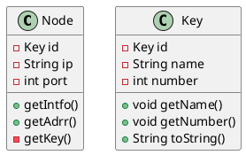

# Distributed Legder

# diagram

```plantuml
@startuml
  class Node {
    - Key id
    - String ip
    - int port 
    
    + getIntfo()
    + getAdrr()
    - getKey()
  } 
  
  class Key {
    - Key id
    - String name
    - int number 
    
    +void getName()
    +void getNumber()
    +String toString()
  }
@enduml
```