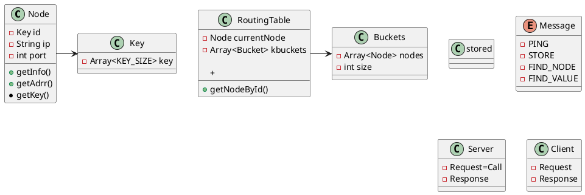

# Distributed Legder

Requisitos e estrutura da rede distribuida

## Diagrama de classes da rede distribuida

```plantuml
@startuml
  class Node {
    - Key id
    - String ip
    - int port 
    
    + getInfo()
    + getAdrr()
    * getKey()
  } 
  
  class Key {
    - Array<KEY_SIZE> key
  }
  
  class Buckets{
    - Array<Node> nodes 
    - int size
  }
  
  class RoutingTable{
   - Node currentNode
   - Array<Bucket> kbuckets
   
   + getNodeById()
   + 
   
  }
  
  class stored {
  }
  
  enum Message {
    - PING
    - STORE
    - FIND_NODE
    - FIND_VALUE
  }
  
  class Server {
    - Request=Call
    - Response
  }
  
  class Client { 
    - Request
    - Response
  }
  
  Node -> Key
  RoutingTable -> Buckets
  
   
@enduml
```

