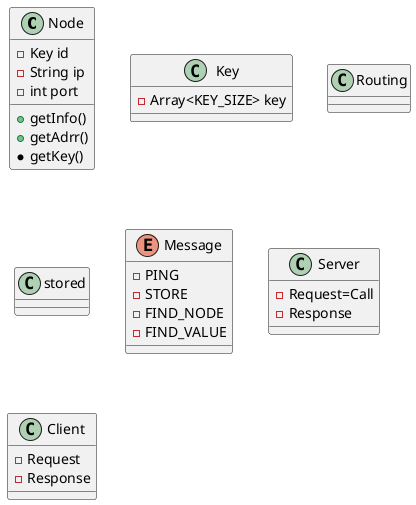

# Distributed Legder

# diagram

```plantuml
@startuml
  class Node {
    - Key id
    - String ip
    - int port 
    
    + getInfo()
    + getAdrr()
    * getKey()
  } 
  
  class Key {
    - Array<KEY_SIZE> key
  }
  
  class Routing{
  
  }
  
  class stored {
  }
  
  enum Message {
    - PING
    - STORE
    - FIND_NODE
    - FIND_VALUE
  }
  
  class Server {
    - Request=Call
    - Response
  }
  
  class Client { 
    - Request
    - Response
  }
  
  
   
@enduml
```

