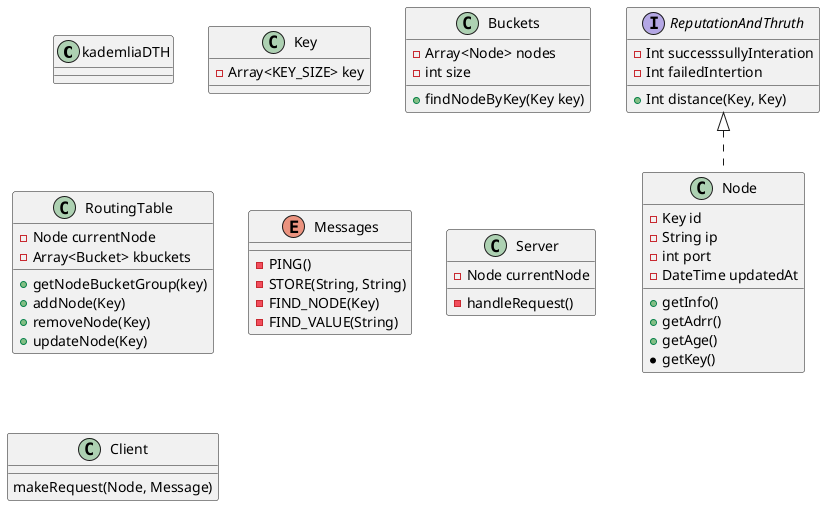

# Distributed Legder

Requisitos e estrutura da rede distribuida

### BootStrap Nodes
Entrypoint to the network

### Diagrama de classes da rede distribuida

```plantuml
@startuml
  class kademliaDTH{
    
  }
  class Node implements ReputationAndThruth {
    - Key id
    - String ip
    - int port 
    - DateTime updatedAt
    
    + getInfo()
    + getAdrr()
    + getAge()
    * getKey()
    
  } 
  
  class Key {
    - Array<KEY_SIZE> key
  }
  
  class Buckets{
    - Array<Node> nodes 
    - int size
    
    + findNodeByKey(Key key)
  }
  
  class RoutingTable{
   - Node currentNode
   - Array<Bucket> kbuckets
   
   + getNodeBucketGroup(key)
   + addNode(Key)
   + removeNode(Key)
   + updateNode(Key)
   
  }
  
  enum Messages {
    - PING()
    - STORE(String, String)
    - FIND_NODE(Key)
    - FIND_VALUE(String)
  }
  
  class Server{
    - Node currentNode
    - handleRequest()
  }
  
  class Client{
    makeRequest(Node, Message)
  }
  
  interface ReputationAndThruth{
  - Int successsullyInteration
  - Int failedIntertion
  
  + Int distance(Key, Key)  
  }
  
  
   
@enduml
```

